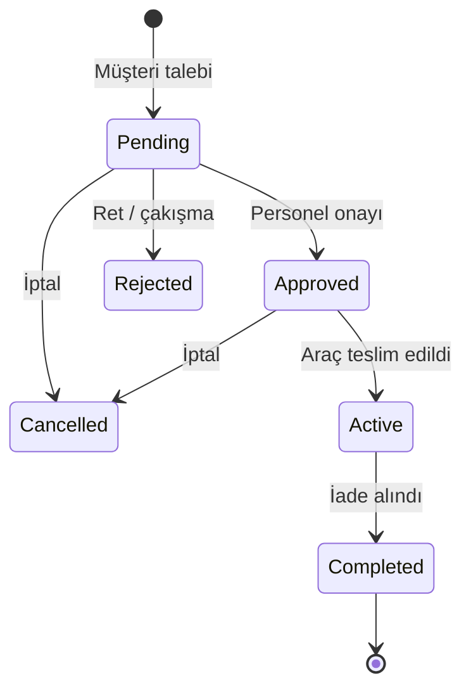
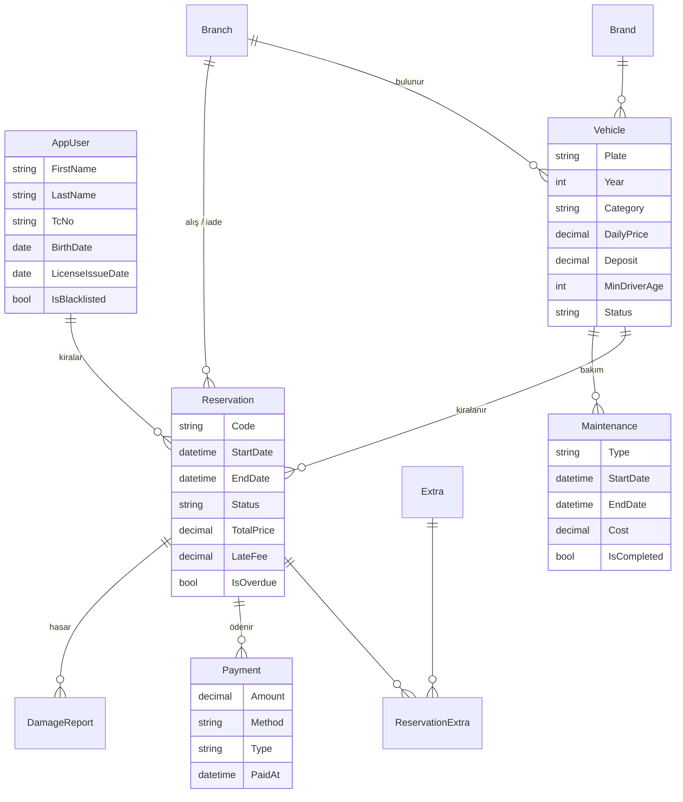

# Rota Rent a Car — Araç Kiralama Otomasyonu

ASP.NET Core MVC (.NET 10) + Entity Framework Core + SQLite ile yazılmış, **web tabanlı ve tamamen C#** bir araç kiralama otomasyonu.

Müşteri sitesi (arama → araç seçimi → 3 adımlı rezervasyon) ve personel paneli (onay, teslim, iade, ödeme, bakım, rapor) tek uygulamada; ayrıca dışarıya açık bir **REST API + Swagger** arayüzü var.

---

## Hızlı başlangıç

Gereken tek şey [.NET 10 SDK](https://dotnet.microsoft.com/download). Veritabanı kurulumu gerekmez.

```bash
cd AracKiralama
dotnet run --project src/AracKiralama.Web
```

Tarayıcıda **http://localhost:5046** adresini açın. İlk çalıştırmada `arackiralama.db` dosyası oluşturulur ve örnek verilerle doldurulur (47 araç, 5 şube, 20+ müşteri, son 12 aya yayılmış ~1.600 kiralama).

| Hesap | E-posta | Şifre |
|---|---|---|
| Admin | `admin@rota.com` | `Rota123!` |
| Personel | `personel@rota.com` | `Rota123!` |
| Müşteri | `musteri@rota.com` | `Rota123!` |
| Genç sürücü (20 yaş) | `genc@rota.com` | `Rota123!` |

> Veritabanını sıfırlamak için uygulamayı kapatıp `src/AracKiralama.Web/arackiralama.db` dosyasını silin ve tekrar çalıştırın.

Testleri çalıştırmak için:

```bash
dotnet test
```

---

## Özellikler

**Müşteri tarafı**
- Şube + tarih ile arama; **sadece o tarihlerde boş olan araçlar** listelenir
- Kategori / vites / yakıt / koltuk / fiyat filtreleri, sıralama, sayfalama (filtreler URL'de → link paylaşılabilir)
- Araç detayında **canlı fiyat hesaplayıcı** (tarih ve ekstra değiştikçe `/api/quote` çağrılır)
- 3 adımlı rezervasyon sihirbazı: tarih & şube → ek hizmetler → sürücü uygunluk kontrolü + onay
- Hesabım: rezervasyonlar, iptal (24 saat kuralı), **PDF kiralama sözleşmesi**, profil & ehliyet bilgileri
- Açık / koyu tema, mobil uyumlu tasarım

**Personel paneli** (`/Admin`)
- Gösterge paneli: KPI kartları, aylık gelir ve kategori grafikleri (Chart.js), bugünün teslim / iade listeleri, gecikme uyarısı
- **Doluluk takvimi**: araç × gün Gantt şeması (CSS Grid ile, harici kütüphane yok)
- Rezervasyon yönetimi: onay / ret, **teslim** (km + yakıt), **iade** (gecikme, yakıt, hasar ücretleri otomatik), ödeme alma
- Araç (görsel yüklemeli), şube, ek hizmet, bakım CRUD'ları
- Müşteriler (harcama, geçmiş, kara liste), ödemeler / kasa
- Raporlar: araç bazlı kullanım oranı, şube geliri, **Excel'e aktarma** (ClosedXML)
- Rol bazlı yetki: **Admin** / **Personel** / **Müşteri**

**Arka planda**
- `OverdueReservationWorker` (BackgroundService): her saat iade tarihi geçmiş kiralamaları işaretler
- T.C. Kimlik No algoritması ve Türk plaka formatı doğrulaması
- 57 birim testi (fiyat motoru, müsaitlik, durum makinesi, doğrulayıcılar)

---

## Mimari

```
Tarayıcı ──► Controller ──► Service (iş kuralları) ──► AppDbContext (EF Core) ──► SQLite
                │                                              ▲
                └──► View (Razor) ◄── ViewModel                │
                                                      Data/DbSeeder.cs (örnek veri)
```

- **Controller'lar ince**: formu alır, servisi çağırır, sonucu gösterir.
- **Bütün iş kuralları `Services/` klasöründe** ve veritabanından bağımsız test edilir.
- İş kuralı ihlali → `BusinessRuleException` (Türkçe mesaj) → ekranda bildirim olarak görünür.

### Klasör yapısı — "Nerede ne var?"

| Ne değiştirmek istiyorsunuz? | Dosya |
|---|---|
| Firma adı, telefon, adres | `src/AracKiralama.Web/appsettings.json` → `Site` |
| İndirim oranları, tek yön / geç iade / yakıt ücretleri | `appsettings.json` → `Pricing` |
| Fiyat hesaplama mantığı | `Services/PricingService.cs` |
| "Araç boş mu?" kuralı | `Services/AvailabilityService.cs` |
| Onay / teslim / iade / iptal akışı | `Services/ReservationService.cs` |
| Dashboard ve rapor verileri | `Services/ReportService.cs` |
| PDF sözleşme tasarımı | `Services/ContractPdfService.cs` |
| Tablolar ve ilişkiler | `Models/Entities/*.cs`, `Data/AppDbContext.cs` |
| Örnek veriler | `Data/DbSeeder.cs` |
| Renkler, yazı tipi, köşe yuvarlaklığı | `wwwroot/css/site.css` (en üstteki `:root` değişkenleri) |
| Üst menü / alt bilgi | `Views/Shared/_Layout.cshtml`, `_Footer.cshtml` |
| Araç kartı (her yerde aynı) | `Views/Shared/_VehicleCard.cshtml` |
| Yönetim paneli menüsü | `Views/Shared/_AdminLayout.cshtml` |

```
src/AracKiralama.Web/
├─ Program.cs                Servis kayıtları, kimlik doğrulama, veritabanı, rotalar
├─ Models/Entities/          Veritabanı tabloları (Vehicle, Reservation, ...)
├─ Models/Enums/             Durumlar ve seçenekler (Türkçe görünen adlarıyla)
├─ Data/                     DbContext, migration'lar, örnek veri
├─ Services/                 İş kuralları (fiyat, müsaitlik, rezervasyon, rapor, PDF)
├─ ViewModels/               Form ve sayfa modelleri + doğrulama kuralları
├─ Validation/               T.C. Kimlik No ve plaka doğrulayıcıları
├─ Controllers/              Müşteri sayfaları + Api/ (REST)
├─ Areas/Admin/              Personel paneli (controller + view)
├─ Views/                    Razor sayfaları ve ortak parçalar (Shared/)
└─ wwwroot/                  CSS, JS, görseller
tests/AracKiralama.Tests/    xUnit testleri
docs/                        Geliştirici rehberi ve sunum notları
```

---

## İş kuralları

**Müsaitlik** — Bir araç; pasif değilse, aynı tarihlerde *Onaylandı* veya *Kirada* bir rezervasyonu yoksa ve tamamlanmamış bakımı yoksa müsaittir. Çakışma formülü: `a.Başlangıç < b.Bitiş && b.Başlangıç < a.Bitiş` (uç uca kiralamalar çakışmaz). *Onay bekleyen* talepler aracı kilitlemez; personel birini onayladığında çakışan diğer talepler otomatik reddedilir (transaction içinde).

**Fiyat**
- Başlayan her 24 saat = 1 gün
- 7+ gün %10, 30+ gün %20 indirim (sadece kira bedeline)
- Ek hizmetler × gün, farklı şubeye iade +750 ₺
- Geç iade: 59 dk tolerans, sonra her gün için günlük ücret × 1,5
- Eksik yakıt: her ¼ depo 450 ₺
- Alışa 24 saatten az kala müşteri iptali: 1 günlük ücret

**Sürücü uygunluğu** — Her aracın minimum yaş ve ehliyet yılı şartı var (ör. lüks: 27 yaş / 5 yıl). Kara listedeki müşteri rezervasyon yapamaz.

**Durum makinesi**



---

## Veri modeli



Fiyatlar rezervasyon anında **kopyalanır** (snapshot): aracın fiyatı sonradan değişse de eski rezervasyonların tutarı bozulmaz.

---

## REST API

Swagger arayüzü: **http://localhost:5046/swagger**

| Uç nokta | Açıklama |
|---|---|
| `GET /api/vehicles?start&end&category&branchId` | Araç listesi (tarih verilirse sadece müsaitler) |
| `GET /api/vehicles/{id}` | Tek araç |
| `GET /api/vehicles/{id}/availability?start&end` | Müsaitlik |
| `POST /api/quote` | Fiyat teklifi (kalem kalem döküm) |

---

## Kullanılan teknolojiler

| | |
|---|---|
| Web | ASP.NET Core MVC 10, Razor, Areas, ViewComponent, Tag Helper |
| Veri | Entity Framework Core 10, SQLite, Migrations |
| Kimlik | ASP.NET Core Identity (rol bazlı yetki) |
| Arayüz | Bootstrap 5.3, Bootstrap Icons, Inter, Chart.js |
| PDF / Excel | QuestPDF (Community lisansı), ClosedXML |
| API | OpenAPI + Swagger UI |
| Test | xUnit, SQLite in-memory |

> Bootstrap Icons, Inter yazı tipi ve Chart.js CDN'den yüklenir; sunum sırasında internet bağlantısı olmalıdır.

### SQL Server'a geçmek isterseniz
1. `Microsoft.EntityFrameworkCore.SqlServer` paketini ekleyin.
2. `Program.cs` içinde `UseSqlite(...)` → `UseSqlServer(...)`.
3. `appsettings.json` → `ConnectionStrings:Default` değerini değiştirin.
4. `Data/AppDbContext.cs` içindeki SQLite'a özel `decimal → double` dönüşümü kendiliğinden devre dışı kalır.
5. Eski migration'ları silip `dotnet ef migrations add InitialCreate --project src/AracKiralama.Web --output-dir Data/Migrations` çalıştırın.

---

Yeni bir özellik eklemek için adım adım rehber: **[docs/GELISTIRICI-REHBERI.md](docs/GELISTIRICI-REHBERI.md)** ·
Sunum akışı: **[docs/SUNUM.md](docs/SUNUM.md)**
