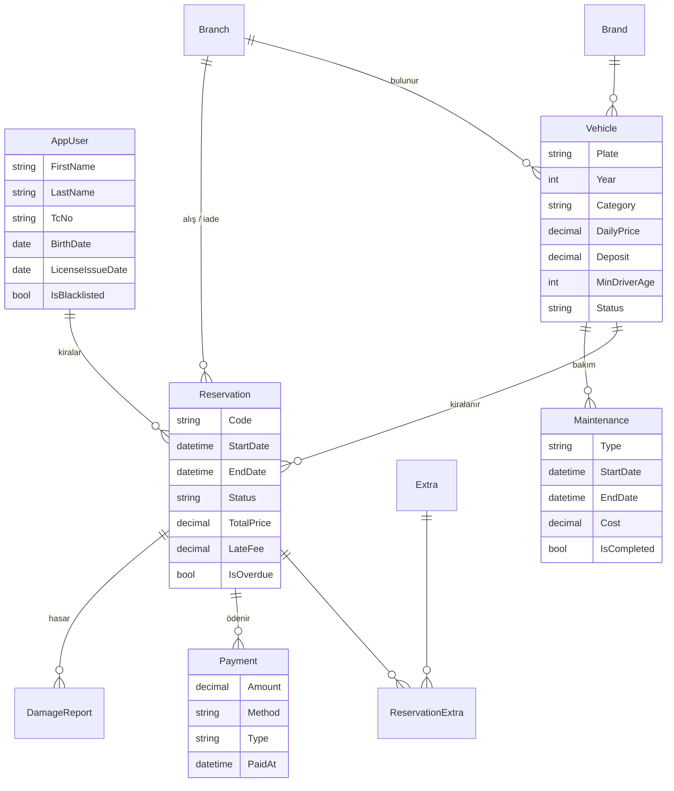

# 🚗 Rota Rent a Car — Araç Kiralama Otomasyonu

Bu proje bir **araç kiralama firmasının bilgisayar sistemidir**. İki parçadan oluşur:

1. **Müşteri sitesi** — Müşterinin araç arayıp rezervasyon yaptığı web sitesi.
2. **Yönetim paneli** — Şube çalışanlarının (personelin) talepleri onayladığı, aracı teslim edip geri aldığı, ödemeleri ve raporları gördüğü bölüm.

Her şey **C#** dilinde, **ASP.NET Core MVC** ile yazılmıştır. Veritabanı kurmanıza **gerek yoktur**; program ilk açıldığında kendi veritabanını oluşturur ve içini örnek verilerle doldurur.

> **Bu dosyayı baştan sona sırayla okuyun.** Hiçbir şey bilmiyor olsanız bile 10 dakika içinde projeyi bilgisayarınızda çalıştırmış olacaksınız.

---

## 📑 İçindekiler

1. [En kısa yol (acelesi olanlar için)](#1-en-kısa-yol-acelesi-olanlar-için)
2. [Kurulum — adım adım](#2-kurulum--adım-adım)
3. [Programı çalıştırmak](#3-programı-çalıştırmak)
4. [Giriş bilgileri (kullanıcı adları ve şifreler)](#4-giriş-bilgileri-kullanıcı-adları-ve-şifreler)
5. [Müşteri olarak kullanım](#5-müşteri-olarak-kullanım)
6. [Yönetim paneli kullanımı (Admin / Personel)](#6-yönetim-paneli-kullanımı-admin--personel)
7. [Sistemin kuralları (fiyat, iptal, gecikme...)](#7-sistemin-kuralları-fiyat-iptal-gecikme)
8. [Örnek verilerde neler var?](#8-örnek-verilerde-neler-var)
9. [API ve Swagger](#9-api-ve-swagger)
10. [Testleri çalıştırmak](#10-testleri-çalıştırmak)
11. [Veritabanını sıfırlamak](#11-veritabanını-sıfırlamak)
12. [Sorun çözme (bir şey çalışmıyorsa)](#12-sorun-çözme-bir-şey-çalışmıyorsa)
13. [Bir şeyi değiştirmek istiyorum — hangi dosya?](#13-bir-şeyi-değiştirmek-istiyorum--hangi-dosya)
14. [Proje nasıl çalışıyor? (teknik bilgi)](#14-proje-nasıl-çalışıyor-teknik-bilgi)
15. [Sözlük — yabancı terimler](#15-sözlük--yabancı-terimler)

---

## 1. En kısa yol (acelesi olanlar için)

Bilgisayarınızda **.NET 10 SDK** kuruluysa, proje klasöründe bir terminal açıp şunu yazın:

```bash
cd AracKiralama
dotnet run --project src/AracKiralama.Web
```

Tarayıcıda **http://localhost:5046** adresine gidin.

- Yönetim paneli için: **admin@rota.com** / şifre **Rota123!**
- Müşteri için: **musteri@rota.com** / şifre **Rota123!**

Bir şey anlamadıysanız aşağıdan devam edin. 👇

---

## 2. Kurulum — adım adım

Sadece **bir kere** yapılır.

### 2.1. .NET 10 SDK'yı kurun (zorunlu)

.NET, C# programlarını çalıştıran Microsoft yazılımıdır.

1. Şu adrese gidin: **https://dotnet.microsoft.com/download/dotnet/10.0**
2. **SDK** başlığının altından işletim sisteminize uygun olanı indirin:
   - Windows kullanıyorsanız: **Windows → x64** (Installer)
   - Mac kullanıyorsanız: **macOS → Arm64** (M1/M2/M3/M4 işlemci) veya **x64** (Intel işlemci)
3. İnen dosyayı açın ve **İleri → İleri → Yükle** diyerek kurun.
4. Kurulum bitince **açık olan bütün terminal / komut istemi pencerelerini kapatın** (yoksa yeni kurulan programı görmezler).

**Kurulduğunu kontrol edin:** Yeni bir terminal açın (aşağıda nasıl açılacağı yazıyor) ve şunu yazın:

```bash
dotnet --version
```

Ekranda `10.0.xxx` gibi bir sayı görüyorsanız tamamdır. ✅
`'dotnet' tanınmıyor` / `command not found` yazıyorsa kurulum olmamıştır veya terminali kapatıp açmamışsınızdır.

### 2.2. Terminal nasıl açılır?

- **Windows:** Başlat menüsüne `PowerShell` yazın ve açın. (Ya da proje klasörüne Dosya Gezgini'nden girip, üstteki adres çubuğuna `powershell` yazıp Enter'a basın — terminal doğrudan o klasörde açılır.)
- **Mac:** `Cmd + Boşluk` → `Terminal` yazın → Enter.

### 2.3. Proje dosyalarını edinin

**A) Dosyalar zaten bilgisayarınızdaysa** (biri size ZIP olarak verdiyse veya klasör hazırsa) bu adımı atlayın.

**B) GitHub'dan indirecekseniz** — önce [Git](https://git-scm.com/downloads) kurulu olmalı. Sonra terminalde:

```bash
git clone https://github.com/zovke/automarket.git
cd automarket
git checkout dotnet-kiralama
```

> ⚠️ **Önemli:** C# projesi `dotnet-kiralama` adlı **branch'tedir** (dal). `git checkout dotnet-kiralama` komutunu unutursanız `AracKiralama` klasörünü göremezsiniz.

İndirdiğiniz klasörün içinde iki şey var:

| Klasör / dosya | Ne? |
|---|---|
| `AracKiralama/` | **Asıl proje (C#).** Bununla çalışacağız. |
| Diğer her şey (`src/`, `prisma/`, `package.json`...) | Eski Next.js projesi. Sadece referans için duruyor, dokunmanıza gerek yok. |

### 2.4. (İsteğe bağlı) Kod düzenleyici

Kodu okumak / değiştirmek için şunlardan biri yeterlidir:

- **Visual Studio 2026** (Windows) — `AracKiralama/AracKiralama.slnx` dosyasına çift tıklayın, üstteki yeşil ▶ butonuna basın. .NET 10 için Visual Studio'nun güncel sürümü gerekir.
- **Visual Studio Code** (Windows / Mac) — `AracKiralama` klasörünü açın, istediğinde **C# Dev Kit** eklentisini kurun.
- **JetBrains Rider** — `AracKiralama.slnx` dosyasını açın.

Programı çalıştırmak için düzenleyici **şart değildir**; terminal yeterlidir.

---

## 3. Programı çalıştırmak

1. Terminali açın ve proje klasörüne gidin. Örneğin proje masaüstündeyse:
   ```bash
   cd Desktop/automarket/AracKiralama
   ```
   (Klasörün yerini bilmiyorsanız: Dosya Gezgini'nde `AracKiralama` klasörüne girin, adres çubuğuna `powershell` yazıp Enter.)

2. Şu komutu yazın:
   ```bash
   dotnet run --project src/AracKiralama.Web
   ```

3. **İlk çalıştırmada** biraz bekleyin (internetten paketler iner + veritabanı oluşturulur, 30 sn – 2 dk sürebilir). Ekranda şuna benzer bir satır görünce hazırdır:
   ```
   Now listening on: http://localhost:5046
   ```

4. Tarayıcı kendiliğinden açılmazsa, Chrome / Edge / Firefox'a şu adresi yazın:

   ### 👉 http://localhost:5046

5. **Kapatmak için:** terminale tıklayın ve `Ctrl + C` tuşlarına basın.

> 💡 Terminal penceresi açık kaldığı sürece site çalışır. Pencereyi kapatırsanız site de kapanır.
>
> 💡 Sunumda internet bağlantısı olsun: ikonlar, yazı tipi ve grafikler internetten yüklenir.

### Önemli adresler

| Adres | Ne açılır? |
|---|---|
| http://localhost:5046 | Müşteri sitesi (ana sayfa) |
| http://localhost:5046/Admin | Yönetim paneli (önce giriş yapmak gerekir) |
| http://localhost:5046/Account/Login | Giriş sayfası |
| http://localhost:5046/swagger | API test arayüzü |

---

## 4. Giriş bilgileri (kullanıcı adları ve şifreler)

> 🔑 **Bütün hazır hesapların şifresi aynıdır: `Rota123!`** (büyük R, sonda ünlem işareti)

| Rol | E-posta (kullanıcı adı) | Şifre | Ne yapabilir? |
|---|---|---|---|
| 👑 **Admin** (yönetici) | `admin@rota.com` | `Rota123!` | **Her şey.** Yönetim panelinin tamamı + personel ekleme / rol değiştirme. |
| 🧑‍💼 **Personel** (şube çalışanı) | `personel@rota.com` | `Rota123!` | Yönetim paneli (rezervasyon, araç, müşteri, rapor...). Sadece "Personel & Roller" sayfasını göremez. |
| 🙂 **Müşteri** | `musteri@rota.com` | `Rota123!` | Araç arar, rezervasyon yapar, iptal eder, sözleşme indirir. Yönetim paneline **giremez**. |
| 🧒 **Genç müşteri** (20 yaşında) | `genc@rota.com` | `Rota123!` | Normal müşteri ama yaşı küçük olduğu için **SUV ve lüks araçları kiralayamaz**. Kuralı göstermek için var. |

Ayrıca 20 tane örnek müşteri daha var; hepsinin şifresi yine `Rota123!`. E-postaları `ad.soyad@example.com` şeklindedir, örneğin:
`mehmet.demir@example.com`, `zeynep.celik@example.com`, `ahmet.sahin@example.com`, `elif.yildiz@example.com` …
(Tam listeyi yönetim panelindeki **Müşteriler** sayfasında görebilirsiniz.)

**Giriş nasıl yapılır?**
1. Sağ üstteki **Giriş Yap** butonuna basın.
2. Giriş sayfasının altındaki **"Demo hesaplar"** kutusundan birine tıklarsanız e-posta kendiliğinden yazılır; siz sadece şifreyi (`Rota123!`) yazın.
3. **Admin veya Personel** ile girerseniz doğrudan **yönetim paneline** gidersiniz. Müşteri ile girerseniz ana sayfaya dönersiniz.

**Çıkış yapmak:** Sağ üstteki **Hesabım** → **Çıkış Yap**. (Yönetim panelinde: sol alttaki çıkış ikonu.)

**Yeni hesap açmak:** Sağ üstte **Üye Ol**. Yeni açılan her hesap **müşteri** olur. Yeni bir **personel** veya **admin** hesabını sadece admin, yönetim panelindeki **Personel & Roller** sayfasından açabilir.

**Şifremi unuttum?** Bu projede şifre sıfırlama yok. Hazır hesapların şifresi her zaman `Rota123!`'dir. Kendi açtığınız bir hesabın şifresini unuttuysanız [veritabanını sıfırlayın](#11-veritabanını-sıfırlamak) (tüm hesaplar ilk haline döner).

---

## 5. Müşteri olarak kullanım

`musteri@rota.com` ile giriş yapın (veya hiç giriş yapmadan araçlara bakabilirsiniz; rezervasyon için giriş şart).

### 5.1. Araç aramak
1. Ana sayfadaki büyük kutudan **alış şubesi**, **iade şubesi**, **alış tarihi** ve **iade tarihi**ni seçin.
2. **Araç Bul**'a basın.
3. Sadece **o tarihlerde boş olan** araçlar listelenir. Her kartta günlük fiyat ve toplam yaklaşık tutar yazar.
4. Soldaki filtrelerle daraltın: **Kategori** (Ekonomi, Orta Sınıf, SUV, Lüks, Ticari), **Vites**, **Yakıt**, **Koltuk sayısı**, **Günlük en fazla fiyat**, **Sıralama**. Filtreyi değiştirdiğiniz anda liste yenilenir.

### 5.2. Araç detayı ve canlı fiyat
1. Bir araçta **İncele**'ye basın.
2. Sağdaki kutuda tarihleri, şubeleri ve ek hizmetleri (Tam Kasko, Bebek Koltuğu...) değiştirin. **Fiyat dökümü anında güncellenir**: gün sayısı, indirim, ekstralar, tek yön ücreti, toplam.
3. Araç o tarihlerde doluysa sarı bir uyarı çıkar ve buton pasif olur → başka tarih deneyin.

### 5.3. Rezervasyon yapmak (3 adım)
1. Detay sayfasında **Rezervasyon Yap**.
2. **Adım 1 – Tarih & Şube:** kontrol edin, **Devam**.
3. **Adım 2 – Ek Hizmetler:** istediklerinizi işaretleyin, isterseniz not yazın, **Devam**.
4. **Adım 3 – Özet & Onay:** sürücü bilgileriniz kontrol edilir (yaş ve ehliyet süresi yeterli mi?). **Kiralama koşullarını kabul ediyorum** kutusunu işaretleyin → **Talebi Gönder**.
5. Size bir **rezervasyon kodu** verilir (örn. `RZ-2026-1350`). Rezervasyonunuz **"Onay Bekliyor"** durumundadır; personel onaylayınca **"Onaylandı"** olur.

> ⚠️ **Yeni üye olduysanız** önce **Hesabım → Profil ve Ehliyet** sayfasından **doğum tarihi** ve **ehliyet veriliş tarihi** girmeniz gerekir. Bu bilgiler olmadan rezervasyon yapılamaz (sistem sizi oraya yönlendirir).

### 5.4. Rezervasyonlarım
Sağ üst **Hesabım → Rezervasyonlarım**:
- **Aktif ve yaklaşan** rezervasyonlar kart olarak görünür; durum rozeti (Onay Bekliyor / Onaylandı / Kirada) yazar.
- **İptal et:** Alış saatine **24 saatten fazla** varsa ücretsizdir; daha az kaldıysa 1 günlük ücret kesilir.
- **Sözleşme:** Onaylanmış rezervasyonların **PDF kiralama sözleşmesi** yeni sekmede açılır; oradan indirebilir / yazdırabilirsiniz.
- **Geçmiş:** tamamlanan, iptal edilen ve reddedilen rezervasyonlar tablo halinde.

### 5.5. Diğer
- Sağ üstteki 🌙 / ☀️ butonu **koyu / açık tema** arasında geçiş yapar.
- Site telefondan da düzgün görünür.

---

## 6. Yönetim paneli kullanımı (Admin / Personel)

`admin@rota.com` / `Rota123!` ile giriş yapın → kendiliğinden **http://localhost:5046/Admin** açılır.

Sol tarafta menü vardır (telefonda sol üstteki ☰ butonuyla açılır). Üstteki arama kutusuna **rezervasyon kodu, plaka veya müşteri adı** yazıp Enter'a basarak her yerden arama yapabilirsiniz.

### Menüdeki sayfalar

| Sayfa | Ne işe yarar? |
|---|---|
| **Gösterge Paneli** | Ana ekran. Bu ayın geliri, doluluk oranı (kaç araç şu an kirada), onay bekleyen talep sayısı, bakımdaki araçlar. Aylık gelir grafiği, kategori grafiği. **Bugün teslim edilecek** ve **bugün iade alınacak** araçlar. Gecikmiş kiralama varsa en üstte **kırmızı uyarı**. |
| **Doluluk Takvimi** | Her satır bir araç, her sütun bir gün. Renkli kutular rezervasyonlardır (renk = durum). Kutunun üstüne gelince detay, tıklayınca rezervasyon açılır. Şube / kategori / gün sayısına göre filtrelenir; ‹ › ile hafta değiştirilir. |
| **Rezervasyonlar** | Tüm rezervasyonlar. Üstteki sekmelerle duruma göre süzülür (Onay Bekliyor, Onaylandı, Kirada, Gecikmiş...). Satırdaki butonlarla hızlıca **Onayla / Teslim et / İade al**. Sarı rozetteki sayı bekleyen taleplerdir. |
| **Araçlar** | Filodaki bütün araçlar. **Yeni araç** ekle, düzenle, görsel yükle, sil. Aracın detayında toplam geliri, son kiralamaları ve bakım geçmişi. |
| **Bakım** | Bakım kayıtları. Bakım tarihleri boyunca araç **kiralanamaz**. Bakım bitince **Tamamla**'ya basın. |
| **Ödemeler** | Alınan bütün ödemeler (kasa). Tarih, yöntem (Nakit / Kredi Kartı / Havale) ve türe göre süzülür; üstte toplamlar. |
| **Müşteriler** | Bütün müşteriler, toplam harcamalarına göre sıralı. Müşteri detayında bilgileri ve geçmişi. **Kara listeye al** → o müşteri artık rezervasyon yapamaz. |
| **Raporlar** | Seçilen tarih aralığında gelir, kiralama sayısı, araç bazlı **kullanım oranı** ve şubelere göre gelir. **Excel'e aktar** butonu raporu `.xlsx` dosyası olarak indirir. |
| **Şubeler** | Şube ekle / düzenle / sil. (Aracı veya rezervasyonu olan şube silinemez.) |
| **Ek Hizmetler** | Tam Kasko, Bebek Koltuğu gibi ekstraların adı, günlük fiyatı, ikonu, aktif/pasif durumu. |
| **Personel & Roller** | **Sadece Admin görür.** Yeni personel/admin hesabı açma, Admin ↔ Personel rol değiştirme. |

### Bir rezervasyonun baştan sona yolculuğu

Bir rezervasyonun detay sayfasında (Rezervasyonlar → koda tıklayın) üstte o an yapılabilecek butonlar görünür:

```
 Müşteri talep gönderir
          │
          ▼
 ┌─────────────────┐   Reddet    ┌────────────┐
 │  Onay Bekliyor  │ ──────────► │ Reddedildi │
 └─────────────────┘             └────────────┘
          │ Onayla
          ▼
 ┌─────────────────┐   İptal     ┌──────────────┐
 │    Onaylandı    │ ──────────► │ İptal Edildi │
 └─────────────────┘             └──────────────┘
          │ Aracı teslim et (km + yakıt)
          ▼
 ┌─────────────────┐
 │      Kirada     │  (iade tarihi geçerse "Gecikmiş" görünür)
 └─────────────────┘
          │ İade al (km, yakıt, hasar)
          ▼
 ┌─────────────────┐
 │   Tamamlandı    │
 └─────────────────┘
```

1. **Onayla:** Araç o tarihlerde gerçekten boşsa onaylanır. Aynı araca aynı tarihlerde başka bekleyen talepler varsa **otomatik reddedilir**. *Reddet* derseniz bir sebep yazmanız istenir.
2. **Aracı teslim et:** Aracın kilometresi ve yakıt seviyesi girilir, kontrol listesi işaretlenir. Araç "Kirada" olur.
3. **İade al:** İade zamanı, kilometre, yakıt seviyesi ve varsa hasar bedeli girilir. Sistem **geç iade ücretini**, **eksik yakıt ücretini** ve hasarı **kendisi hesaplayıp** toplama ekler. Araç tekrar müsait olur ve iade edilen şubeye geçer.
4. **Ödeme al:** Sağdaki "Ödemeler" kutusundan tutar, yöntem ve tür seçip **Ödemeyi kaydet**. "Kalan" tutarı kendiliğinden düşer.
5. **Sözleşme PDF:** Her aşamada sözleşmeyi yeni sekmede açar.

### Yeni araç eklemek
1. **Araçlar → Yeni araç**.
2. Plaka (örn. `34 ABC 123` — sistem Türk plaka formatını kontrol eder), marka, model, yıl, kategori, yakıt, vites, koltuk, renk, km, şube.
3. Günlük fiyat, depozito, minimum sürücü yaşı ve ehliyet yılı.
4. Sağdan bir **görsel** seçin (JPG/PNG/WEBP, en fazla 5 MB). Önizleme hemen görünür.
5. **Kaydet**. Araç müşteri sitesinde de hemen listelenir.

> Kiralama geçmişi olan araç **silinmez**, "Pasif" yapılır (raporlar bozulmasın diye). Pasif araçlar müşteri sitesinde görünmez.

---

## 7. Sistemin kuralları (fiyat, iptal, gecikme...)

Bu kurallar otomatik uygulanır. Oranlar `src/AracKiralama.Web/appsettings.json` dosyasındaki **Pricing** bölümünden değiştirilebilir.

| Kural | Değer |
|---|---|
| Gün hesabı | Başlayan her 24 saat = 1 gün (25 saat → 2 gün). En az 1 gün. |
| Uzun kiralama indirimi | **7 gün ve üzeri %10**, **30 gün ve üzeri %20** (sadece kira bedeline, ekstralara değil) |
| Ek hizmetler | Günlük fiyat × gün sayısı |
| Farklı şubeye iade | +**750 ₺** (tek yön ücreti) |
| Geç iade | **59 dakika** tolerans; sonrasında başlayan her gün için **günlük fiyat × 1,5** |
| Eksik yakıt | Eksik her **¼ depo** için **450 ₺** |
| İptal | Alışa **24 saatten fazla** varken ücretsiz; daha geç iptalde **1 günlük ücret** |
| En uzun kiralama | 90 gün |
| Geçmiş tarihe rezervasyon | Yapılamaz |
| Kara listedeki müşteri | Rezervasyon yapamaz |

**Araç ne zaman "dolu" sayılır?**
- Aynı tarihlerde **Onaylandı** veya **Kirada** bir rezervasyonu varsa,
- O tarihlerde **tamamlanmamış bir bakım** kaydı varsa,
- Araç **Pasif** ise.

"Onay Bekliyor" talepler aracı kilitlemez (aynı araca birden fazla kişi talep gönderebilir; personel birini onaylayınca diğerleri otomatik reddedilir). Bir kiralama biterken diğerinin başlaması (uç uca) **çakışma sayılmaz**.

**Sürücü şartları (kategoriye göre, örnek verilerde):**

| Kategori | Min. yaş | Min. ehliyet | Depozito |
|---|---|---|---|
| Ekonomi | 21 | 1 yıl | 3.000 ₺ |
| Orta Sınıf | 21 | 2 yıl | 5.000 ₺ |
| SUV | 23 | 3 yıl | 7.500 ₺ |
| Ticari | 23 | 2 yıl | 4.000 ₺ |
| Lüks | 27 | 5 yıl | 12.000 ₺ |

**Durum adlarının anlamı:**

| Durum | Anlamı |
|---|---|
| 🟡 Onay Bekliyor | Müşteri talep gönderdi, personel henüz bakmadı |
| 🔵 Onaylandı | Personel onayladı, araç müşteriyi bekliyor |
| 🟢 Kirada | Araç müşteride |
| 🔴 Gecikmiş | Kirada ama iade tarihi geçti |
| ✅ Tamamlandı | Araç iade edildi |
| ⚪ İptal Edildi | Müşteri veya personel iptal etti |
| 🔴 Reddedildi | Personel reddetti veya araç başkasına verildi |

**Gecikme takibi:** Program açıkken arka planda saatte bir kontrol yapılır; iade tarihi geçmiş araçlar "Gecikmiş" olarak işaretlenir ve gösterge panelinde kırmızı uyarı çıkar.

---

## 8. Örnek verilerde neler var?

Program ilk açıldığında otomatik oluşturulur (`Data/DbSeeder.cs`):

- **47 araç** — Audi, Fiat, Ford, Hyundai, Peugeot, Renault, Volkswagen; gerçek fotoğraflarla.
- **5 şube** — İstanbul Havalimanı, Kadıköy, Ankara Esenboğa, İzmir Adnan Menderes, Antalya Havalimanı.
- **6 ek hizmet** — Tam Kasko (350 ₺/gün), Ek Sürücü (150), Bebek Koltuğu (120), Mobil Wi-Fi (110), Navigasyon (90), Kar Zinciri (80).
- **24 kullanıcı** — 1 admin, 1 personel, 22 müşteri (bkz. [Giriş bilgileri](#4-giriş-bilgileri-kullanıcı-adları-ve-şifreler)).
- **~1.600 kiralama** — son 12 aya yayılmış; tamamlanmış, iptal edilmiş, reddedilmiş, şu an kirada olan, gelecekteki onaylı ve bekleyen talepler. Grafikler bu sayede dolu görünür.
- **Hazır "bugün" senaryoları** — bugün teslim edilecek 2 araç, bugün iade alınacak 2 araç, **gecikmiş 2 kiralama**, onay bekleyen talepler ve şu an bakımda olan 1 araç. Sunumda doğrudan gösterebilirsiniz.

Örnek veriler her kurulumda **aynıdır** (sabit rastgelelik). T.C. kimlik numaraları algoritmaya uygun ama uydurmadır; gerçek kişilere ait değildir.

---

## 9. API ve Swagger

API, başka programların (örneğin bir mobil uygulamanın) bu sisteme bağlanabilmesi içindir. Sitedeki canlı fiyat hesaplayıcı da bu API'yi kullanır.

**Denemek için:** http://localhost:5046/swagger adresine gidin → bir satıra tıklayın → **Try it out** → değerleri girin → **Execute**.

| Adres | Ne yapar? |
|---|---|
| `GET /api/vehicles` | Araçları listeler. `start`, `end` (tarih), `category`, `branchId` verilebilir; tarih verilirse sadece boş araçlar gelir. |
| `GET /api/vehicles/{id}` | Tek bir aracın bilgileri |
| `GET /api/vehicles/{id}/availability?start=...&end=...` | Araç o tarihlerde boş mu? |
| `POST /api/quote` | Fiyat teklifi hesaplar (kalem kalem) |

`POST /api/quote` için örnek gövde:

```json
{
  "vehicleId": 5,
  "start": "2026-11-02T10:00",
  "end": "2026-11-10T10:00",
  "pickupBranchId": 1,
  "returnBranchId": 2,
  "extraIds": [1, 3]
}
```

---

## 10. Testleri çalıştırmak

Testler, sistemin kurallarının (fiyat, çakışma, iptal, iade...) doğru çalıştığını otomatik kontrol eden küçük programlardır.

1. **Önce çalışan siteyi kapatın** (terminalde `Ctrl + C`). Açık kalırsa "dosya kullanımda" hatası alırsınız.
2. `AracKiralama` klasöründe:
   ```bash
   dotnet test
   ```
3. Sonunda şunu görmelisiniz:
   ```
   Başarılı!  - Başarısız: 0, Başarılı: 57 ...
   ```

Test dosyaları `tests/AracKiralama.Tests/` klasöründedir; test adları Türkçedir, okuyunca ne kontrol ettiği anlaşılır (örn. `Gec_iade_her_gun_icin_bir_bucuk_kat_ucretlenir`).

---

## 11. Veritabanını sıfırlamak

Her şeyi ilk haline (örnek verilere) döndürmek için:

1. Siteyi kapatın (`Ctrl + C`).
2. `AracKiralama/src/AracKiralama.Web/` klasöründeki şu dosyaları silin:
   - `arackiralama.db`
   - varsa `arackiralama.db-shm` ve `arackiralama.db-wal`
3. Siteyi tekrar çalıştırın. Veritabanı sıfırdan oluşturulur (birkaç saniye sürer).

> Sunumdan önce bunu yapmanız önerilir: tarihler "bugüne" göre üretildiği için "bugün teslim / gecikmiş" senaryoları taze olur.

---

## 12. Sorun çözme (bir şey çalışmıyorsa)

| Gördüğünüz | Sebebi | Çözüm |
|---|---|---|
| `'dotnet' tanınmıyor` / `command not found` | .NET SDK kurulu değil veya terminal eski | [2.1](#21-net-10-sdkyı-kurun-zorunlu)'i yapın, **terminali kapatıp yeniden açın**. |
| `Couldn't find a project to run` | Yanlış klasördesiniz | `cd` ile `AracKiralama` klasörüne gidin. `dir` (Windows) / `ls` (Mac) yazınca `src` klasörünü görmelisiniz. |
| `AracKiralama` klasörü yok | Yanlış branch | `git checkout dotnet-kiralama` |
| `address already in use` / `port 5046` hatası | Site zaten başka bir pencerede açık | Diğer terminalde `Ctrl + C` yapın veya o pencereyi kapatın. |
| `The process cannot access the file ... because it is being used` | Site açıkken `dotnet test` / `dotnet build` yaptınız | Siteyi kapatıp tekrar deneyin. |
| `Failed to determine the https port for redirect` uyarısı | Normal, zararsız | Görmezden gelin. |
| İkonlar kare kare, grafikler boş | İnternet yok | İnternete bağlanın (ikon, yazı tipi ve grafik kütüphanesi internetten gelir). |
| "Bu sayfaya erişim yetkiniz yok" | Müşteri hesabıyla `/Admin`'e girmeye çalıştınız | Çıkış yapıp `admin@rota.com` ile girin. |
| "E-posta veya şifre hatalı" | Şifre yanlış yazıldı | Şifre: `Rota123!` — büyük **R**, sonda **!**. Klavyenin Türkçe/İngilizce olmasına dikkat. |
| Rezervasyonda "profil bilgileri eksik" | Doğum / ehliyet tarihi girilmemiş | Hesabım → Profil ve Ehliyet → doldurun. |
| "Araç seçtiğiniz tarihlerde müsait değil" | Araç o tarihlerde dolu | Başka tarih veya araç seçin (bu bir hata değil, kural). |
| Butona basınca hiçbir şey olmuyor | Formda eksik / hatalı alan var | Kırmızı yazılan alanları düzeltin. |
| Veriler karıştı, demo bozuldu | — | [Veritabanını sıfırlayın](#11-veritabanını-sıfırlamak). |
| İlk çalıştırmada uzun süre bekliyor | Paketler internetten iniyor | Bekleyin; sadece ilk sefer uzun sürer. |

---

## 13. Bir şeyi değiştirmek istiyorum — hangi dosya?

Bütün yollar `AracKiralama/src/AracKiralama.Web/` klasörüne göredir.

| Ne değiştirmek istiyorsunuz? | Dosya |
|---|---|
| Firma adı ("Rota"), telefon, e-posta, adres | `appsettings.json` → `Site` bölümü |
| İndirim oranları, tek yön / geç iade / yakıt / iptal ücretleri | `appsettings.json` → `Pricing` bölümü |
| Hazır hesapların şifresi | `Data/DbSeeder.cs` → `DemoPassword` (sonra veritabanını sıfırlayın) |
| Örnek araçlar, şubeler, müşteriler | `Data/DbSeeder.cs` (sonra veritabanını sıfırlayın) |
| Sitenin renkleri, yazı tipi, köşe yuvarlaklığı | `wwwroot/css/site.css` — en üstteki `:root` bölümü |
| Üst menü | `Views/Shared/_Layout.cshtml` |
| Alt bilgi (footer) | `Views/Shared/_Footer.cshtml` |
| Ana sayfa yazıları | `Views/Home/Index.cshtml` |
| Araç kartının görünümü (her yerde aynı kart) | `Views/Shared/_VehicleCard.cshtml` |
| Yönetim paneli menüsü | `Views/Shared/_AdminLayout.cshtml` |
| Durum adları ("Onay Bekliyor" vb.) | `Models/Enums/Enums.cs` |
| Fiyat hesaplama mantığı | `Services/PricingService.cs` |
| "Araç boş mu?" kuralı | `Services/AvailabilityService.cs` |
| Onay / teslim / iade / iptal kuralları | `Services/ReservationService.cs` |
| Gösterge paneli ve rapor rakamları | `Services/ReportService.cs` |
| PDF sözleşmenin tasarımı ve maddeleri | `Services/ContractPdfService.cs` |
| Hata mesajları | İlgili servis dosyasındaki `BusinessRuleException("...")` satırları |

> Kod dosyasında (`.cs`) değişiklik yaptıktan sonra siteyi kapatıp (`Ctrl + C`) tekrar `dotnet run` ile açın.
> Sadece `site.css` gibi dosyalarda değişiklik yaptıysanız tarayıcıda `Ctrl + F5` yeterli olabilir.

Adım adım örnekler (yeni alan ekleme, yeni sayfa ekleme, yeni fiyat kuralı): **[docs/GELISTIRICI-REHBERI.md](docs/GELISTIRICI-REHBERI.md)**
Sunum akışı ve hocanın sorabileceği sorular: **[docs/SUNUM.md](docs/SUNUM.md)**

---

## 14. Proje nasıl çalışıyor? (teknik bilgi)

### Kullanılan teknolojiler

| Alan | Teknoloji |
|---|---|
| Dil | C# (.NET 10) |
| Web | ASP.NET Core MVC (Controller + Razor View), Areas, ViewComponent |
| Veritabanı | SQLite (tek dosya) + Entity Framework Core 10 (ORM, Migration) |
| Giriş / yetki | ASP.NET Core Identity — şifreler hash'lenerek saklanır, rol bazlı yetki |
| Arayüz | Bootstrap 5.3, Bootstrap Icons, Inter yazı tipi, Chart.js |
| PDF | QuestPDF (Community lisansı) |
| Excel | ClosedXML |
| API | OpenAPI + Swagger UI |
| Test | xUnit + bellekte çalışan SQLite |

### Bir istek nasıl işlenir?

```
Tarayıcı
   │  (örn. "Onayla" butonuna basıldı)
   ▼
Controller          → formu alır, doğru servisi çağırır          (Controllers/, Areas/Admin/Controllers/)
   ▼
Service             → kuralları uygular, hata varsa durdurur       (Services/)
   ▼
AppDbContext        → veritabanına okur / yazar                    (Data/AppDbContext.cs)
   ▼
SQLite dosyası      → arackiralama.db
   ▲
View (Razor)        ← sonucu HTML olarak kullanıcıya gösterir      (Views/, Areas/Admin/Views/)
```

- **Controller'lar ince:** sadece formu alır, servisi çağırır, sonucu gösterir.
- **Bütün kurallar `Services/` klasöründe:** bu sayede test edilebilir ve hem web sayfaları hem API aynı kuralları kullanır.
- Bir kural ihlal edilirse servis `BusinessRuleException("Türkçe mesaj")` fırlatır; kullanıcı bu mesajı ekranda bildirim olarak görür.

### Klasör yapısı

```
AracKiralama/
├─ AracKiralama.slnx              Çözüm dosyası (Visual Studio ile açılır)
├─ README.md                      Bu dosya
├─ docs/                          Geliştirici rehberi ve sunum notları
├─ src/AracKiralama.Web/          ← UYGULAMA
│  ├─ Program.cs                  Başlangıç: servisler, giriş sistemi, veritabanı, adresler
│  ├─ appsettings.json            Ayarlar (firma bilgisi, fiyat kuralları, veritabanı yolu)
│  ├─ Models/Entities/            Veritabanı tabloları (Araç, Rezervasyon, Şube, Ödeme...)
│  ├─ Models/Enums/               Seçenek listeleri (durumlar, yakıt türleri...)
│  ├─ Data/                       Veritabanı bağlantısı, migration'lar, örnek veriler
│  ├─ Services/                   İŞ KURALLARI (fiyat, müsaitlik, rezervasyon, rapor, PDF)
│  ├─ ViewModels/                 Formların veri modelleri ve doğrulama kuralları
│  ├─ Validation/                 T.C. Kimlik No ve plaka doğrulayıcıları
│  ├─ Controllers/                Müşteri sayfaları + Api/ (REST API)
│  ├─ Areas/Admin/                Yönetim paneli (controller + sayfalar)
│  ├─ Views/                      Müşteri sayfaları + Shared/ (ortak parçalar, menü, kartlar)
│  └─ wwwroot/                    CSS, JavaScript, araç fotoğrafları
└─ tests/AracKiralama.Tests/      Otomatik testler (57 adet)
```

### Veri modeli (tablolar ve ilişkiler)



| Tablo | Ne tutar? |
|---|---|
| `AppUser` | Kullanıcılar (müşteri, personel, admin) + ehliyet bilgileri |
| `Vehicle` | Araçlar |
| `Brand` | Markalar |
| `Branch` | Şubeler |
| `Reservation` | Rezervasyonlar + fiyat dökümü + teslim/iade bilgileri |
| `Extra` / `ReservationExtra` | Ek hizmetler ve hangi rezervasyonda hangisinin seçildiği |
| `Payment` | Ödemeler |
| `Maintenance` | Bakım kayıtları |
| `DamageReport` | İadede tespit edilen hasarlar |

Fiyatlar rezervasyon anında **kopyalanarak** saklanır: aracın fiyatı sonradan değişse bile eski rezervasyonların tutarı değişmez.

### SQL Server'a geçmek isterseniz (isteğe bağlı)
1. `Microsoft.EntityFrameworkCore.SqlServer` paketini ekleyin.
2. `Program.cs` içinde `UseSqlite(...)` yerine `UseSqlServer(...)` yazın.
3. `appsettings.json` → `ConnectionStrings:Default` değerini SQL Server bağlantı cümlesiyle değiştirin.
4. `Data/Migrations` klasörünü silip `dotnet ef migrations add InitialCreate --project src/AracKiralama.Web --output-dir Data/Migrations` çalıştırın.

---

## 15. Sözlük — yabancı terimler

| Terim | Basitçe |
|---|---|
| **Terminal / Komut istemi / PowerShell** | Bilgisayara yazıyla komut verdiğiniz siyah/mavi pencere |
| **.NET SDK** | C# programlarını derleyip çalıştıran Microsoft aracı |
| **localhost** | "Bu bilgisayar" demek. Site sadece sizin bilgisayarınızda çalışır, internete açılmaz. |
| **5046** | Sitenin çalıştığı "kapı numarası" (port) |
| **Branch (dal)** | Git'te projenin ayrı bir sürümü. C# projesi `dotnet-kiralama` dalında. |
| **Seed / örnek veri** | Program ilk açıldığında veritabanına otomatik eklenen deneme verileri |
| **Migration** | Veritabanı tablolarının yapısını oluşturan/güncelleyen hazır komutlar |
| **MVC** | Model (veri) – View (görünüm) – Controller (yönetici): kodun düzenlenme şekli |
| **Servis (Service)** | İş kurallarının yazıldığı sınıflar |
| **API** | Programların birbirleriyle konuştuğu adresler |
| **Swagger** | API'yi tarayıcıdan denemeye yarayan arayüz |
| **Depozito** | Teslimde alınan, araç hasarsız dönünce iade edilen güvence parası |
| **Tek yön** | Aracı aldığınız şubeden farklı bir şubeye bırakmak |
| **Kara liste** | Rezervasyon yapması engellenen müşteriler |
